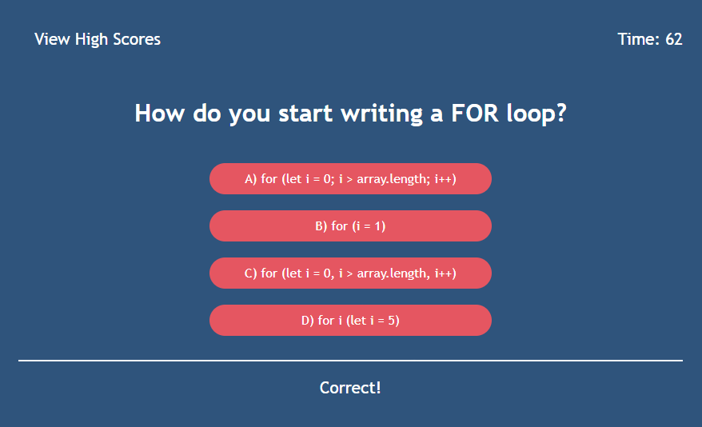

# JavaScript Quiz

A code quiz app that presents web development students with an opportunity to practice for the coding assessment portion of technical interviews they'll face during the hiring process.

## Table of Contents

1. [Usage](#usage)
2. [Screenshots](#screenshots)
3. [Contributors](#contributors)
4. [Badges](#badges)

## Usage

visit: 
https://dossman-thomas.github.io/coding-quiz/

## Screenshots

## Contributors

- [ChatGPT](chat.openai.com) - Helped me understand how to create and style the scoreboard table.

- [Peers from bootcamp] - Collaborated to figure out how to render questions one by one with JavaScript logic. 

## Badges

